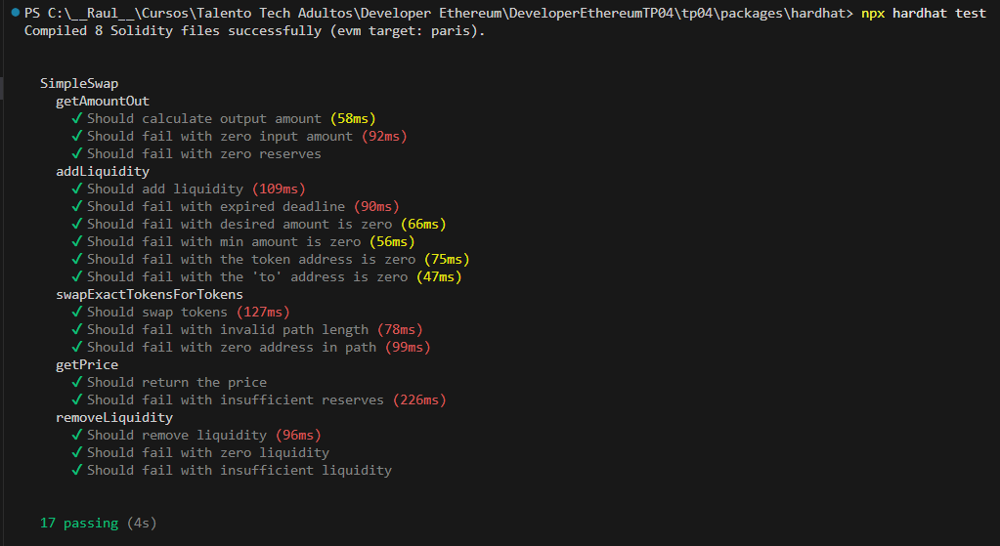
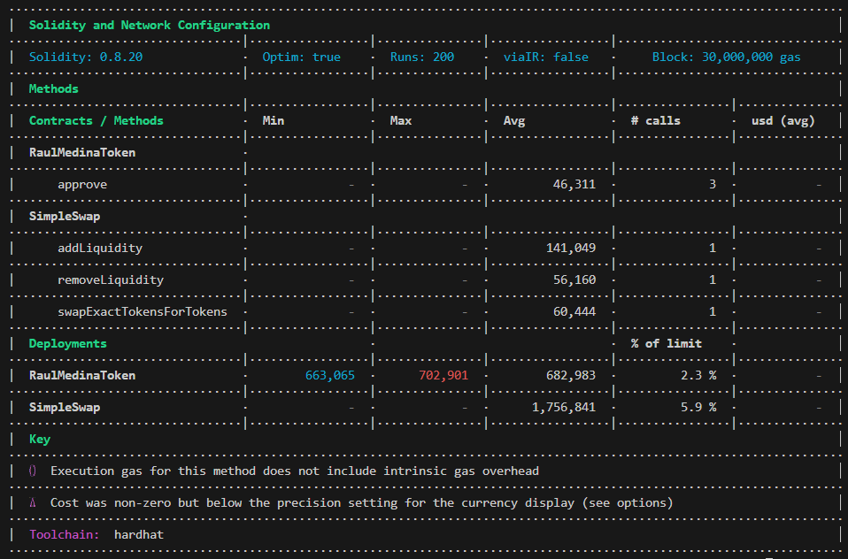
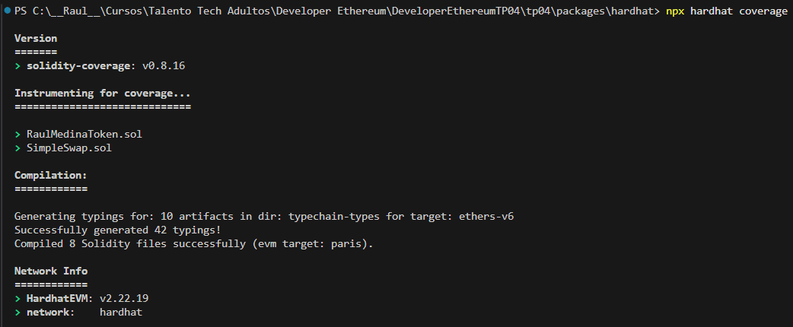
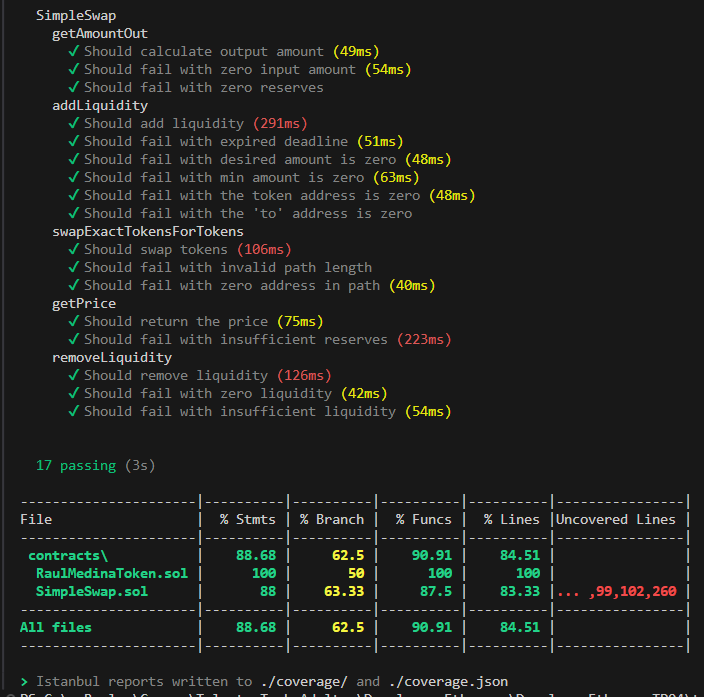

# FINAL PROJECT MODULE 4

## Conduct contract testing with Hardhat
```sh
...\tp04\packages\hardhat> npx hardhat test
```
### Result



## Achieve coverage equal to or greater than 50%
```sh
...\tp04\packages\hardhat> npx hardhat coverage
```
### Result


